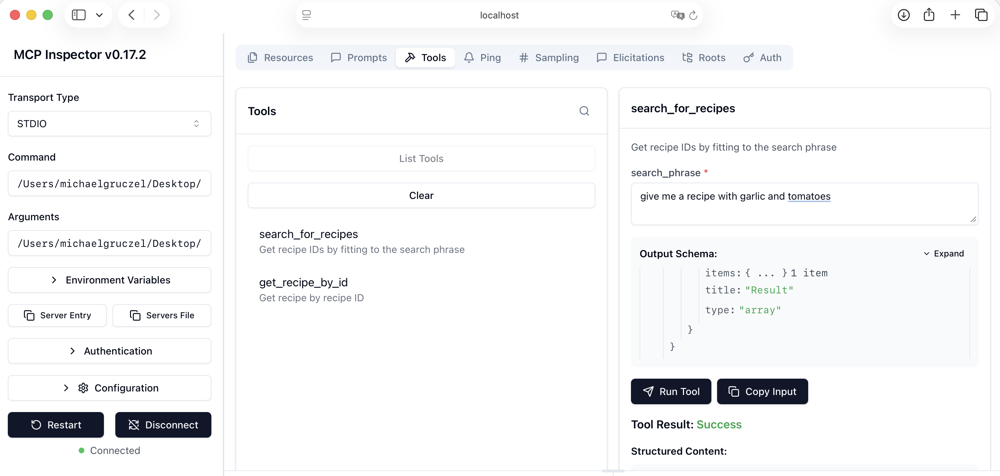
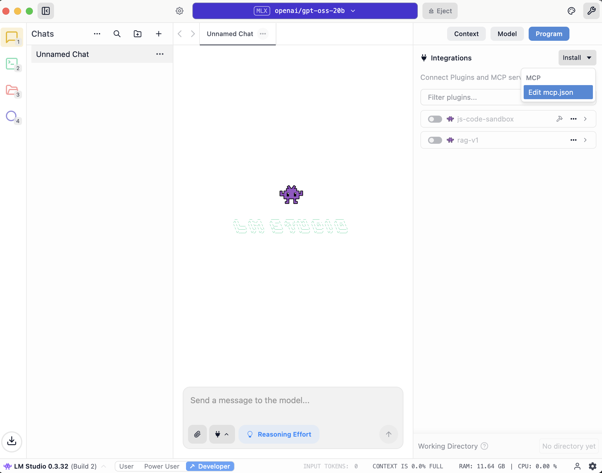
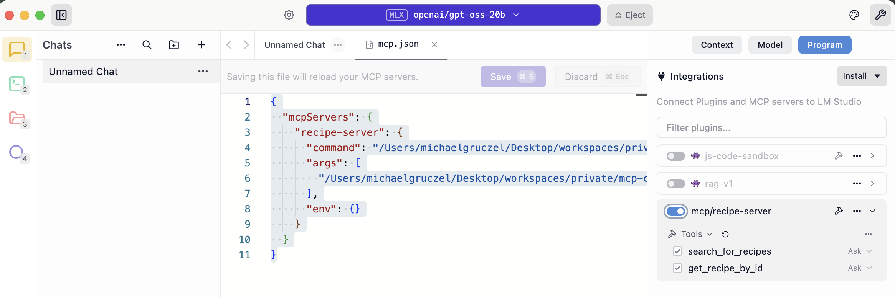
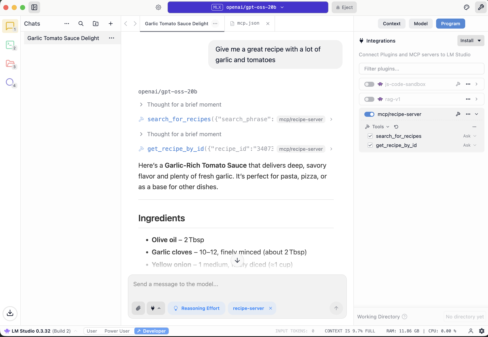
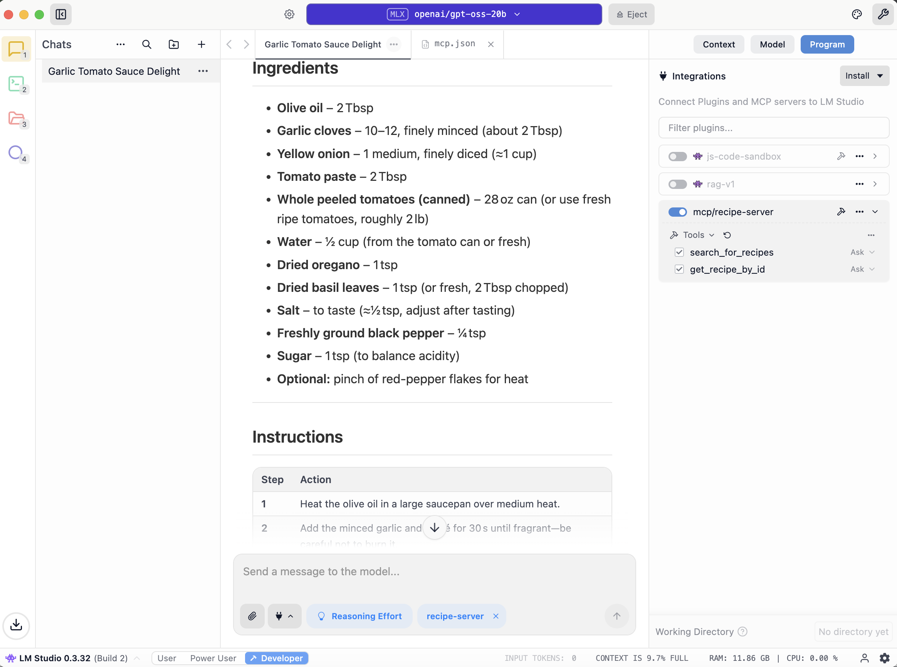

# mcp-cooking-recipes-server-example

This is an example on how to implement a MCP server with a cooking recipe search and 
a recipe retrieval endpoint using python and a vector DB.

MCP (Model Context Protocol) is an open-source standard for connecting AI applications to external systems.
An MCP server is a program that acts as a bridge, allowing AI models to connect to and interact with external tools and data sources.
A MCP host is the main application, for example a chatbot that uses the Model Context Protocol (MCP) to connect to and interact with external tools from a MCP Server.
The MCP host uses a LLM to select the best matching tools and convert responses into natural language answers.

In this example we will run a MCP server which exposes 2 endpoints/tools.

- search_for_recipes - search for recipes in
- get_recipe_by_id - retrieve a recipe by recipe id.

We will connect that MCP Server from a MCP Host (LM Studio) to interact within a natural chat with the MCP server.


The flow is this:

- 1 - the python script 'load_data_db.py' will read a csv file with recipes and load it into a vector DB for search and into a relational DB for single recipe retrieval.
- 2 - a python MCP server 'mcp_tutorial_server.py' will expose its available tools to the MCP Host
- 3 - when we query for a recipe in the MCP host chat (LM Studio), the Host will decide to call the 'search_for_recipes' tool from our MCP server and the MCP server will return an id for the best matching recipe from the vector DB.
- 4 - after our MCP server returned the id, the MCP host will decide to call the 'search_for_recipes' tool from our MCP server and the MCP server will return the recipe from the relational DB. The MCP host will respond in the chat using the connected LLM to make a nice text out of it.

## concepts and tools you should know and prepare upfront

**Vector DB**

Traditional databases organize information in tables and locate data through assigned values.
When you query a traditional database, it returns results that precisely match your query.
A vector database, vector store or vector search engine is a database that can store vectors along with other data items.
Vector databases typically implement one or more Approximate Nearest Neighbor algorithms, so that one can search the database with a query vector to retrieve the closest matching database records.
Vectors are mathematical representations of data in a high-dimensional space.
In this space, each dimension corresponds to a feature of the data, with the number of dimensions.
The token extraction and vector calculation is based on Languages, by using LLMs.

A vector DB uses 3 concepts:
- Embedding - sub elements from image/text/audio are turned into a list of numbers. This process makes documents usable to a machine learning models. An embedding represents the essence of a document.
- Indexing - Vector indexing means storing vector embeddings in a database for efficient similarity searches.
- Querying - Vector databases exhibit the ability to retrieve similar objects based on a query, based on pre-calculated values using a Approximate Nearest Neighbor (ANN) search for indexing and similarity computation.

For our example we will use chroma db https://github.com/chroma-core/chroma.
We use the default chroma DB setting for the embedding.
The default ChromaDB embedding function based on OnnxRuntime and MiniLM-L6-v2 model.
The advantage of all-MiniLM-L6-v2 is that it is small (only 22MB), fast, and accurate.

**Data for use case**

For this example I will use data from kaggle https://www.kaggle.com/datasets/shuyangli94/food-com-recipes-and-user-interactions?select=RAW_recipes.csv
This dataset consists of 180K+ recipes and 700K+ recipe reviews covering 18 years of user interactions and uploads on Food.com (formerly GeniusKitchen).
Download it from the website before you start and extract the RAW_recipes.csv.

**UV**

This example implementation uses python.
In order to use multiple versions of python for different projects, there is the concept of
virtual environments for that. Means every project has its own virtual env with virtual python versions.
Additionally, we want to install packages and manage configurations.
UV is a Python package and project manager and manages all that stuff for us in a nice way 
and replaces tools like ool to replace pip, pip-tools, pipx, pyenv, virtualenv.

Check https://github.com/astral-sh/uv for more details.

So take sure that you have UV installed.

**LM Studio**

LM Studio is a tool to run local LLMs like gpt-oss, Qwen3, Gemma3, 
DeepSeek and many more on your computer, privately and for free.

Download and install lmstudio from https://lmstudio.ai/.

**Docker**

Docker is a hypervisor, that means you can run full operating systems in encapsulation.
The operating systems run with singe applications in a so called container locally.
In our case we will run a small os with a postgres DB in one container and a chromadb in another container.
Take sure that you have docker or another tools which can run docker containers installed.

**MCP inspector**

MCP servers can be used by multiple clients like for example chats which are using LLMs.
We will use LM Studio as MCP Host to call our MCP Server.
But before we check that everything works in a Chat, 
we should check that our Python implementation
exposes usable MCP endpoints. 
The MCP inspector works nicely for that, this way we can call the MCP server endpoints without the overhead of a LLM.

Check https://modelcontextprotocol.io/docs/tools/inspector for more details and ensure that

```
npx @modelcontextprotocol/inspector
```

works. You might need to install npx, see https://docs.npmjs.com/cli/v8/commands/npx.

## Let's get started

**check project setup**

check that UV and python works

```
# install python packages
uv sync --locked

# activate you virtual env
. .venv/bin/activate
```

**load recipes into Databases**

I have prepared a script that loads the recipes from the RAW_recipes.csv file.
It connects to a vector DB and a postgres DB and adds the recipes to booth DBs.
The vector DB is used to search for entries which are close to 
the request and the postgres contain the real data.
You will find that in the file 'load_data_db.py'.
The most important elements are.

Connect to chroma and create table
```
chroma_client = chromadb.HttpClient(host='localhost', port=8000)
...
chroma_client.create_collection("recipes")
chroma_collection = chroma_client.get_collection("recipes")
...
postgres_client = psycopg2.connect(
  dbname='mcp_tutorial_data',
  user='mcp_tutorial_data_db_user', 
  host='localhost',
  password='mcp_tutorial_data_db_password'
)
postgres_cursor.execute(sql.SQL("CREATE TABLE RECIPES (id TEXT not null, name TEXT not null, minutes NUMERIC, n_steps NUMERIC, steps TEXT, ingredients TEXT, n_ingredients NUMERIC);"))
```

Connect to postgres and create table
```
postgres_client = psycopg2.connect(
  dbname='mcp_tutorial_data',
  user='mcp_tutorial_data_db_user', 
  host='localhost',
  password='mcp_tutorial_data_db_password'
)
postgres_cursor.execute(sql.SQL("CREATE TABLE RECIPES (id TEXT not null, name TEXT not null, minutes NUMERIC, n_steps NUMERIC, steps TEXT, ingredients TEXT, n_ingredients NUMERIC);"))
```

add data from csv with recipes

```
with open('RAW_recipes.csv', newline='') as csv_file:
  csv_reader = csv.reader(csv_file, delimiter=',')
  line_count = 0
  for row in csv_reader:
    if line_count == 0:
      print(f'Column names are id{", ".join(row)}')
      line_count += 1
    else:
      # name,id,minutes,contributor_id,submitted,tags,nutrition,n_steps,steps,description,ingredients,n_ingredients
      # 0 name, 1 id, 2 minutes, 3 contributor_id, 4 submitted,
      # 5 tags, 6 nutrition, 7 n_steps, 8 steps,
      # 9 description, 10 ingredients, 11 n_ingredients
      
      text_to_index = str(row[0]) + str(row[8]) + str(row[9])
      chroma_collection.add(
        documents=[text_to_index],
        ids=[row[1]],
        metadatas=[{"complexity": complexity, "duration": duration}],
      )
      insert_text = "INSERT INTO RECIPES (id, name, minutes, n_steps, steps, ingredients, n_ingredients) values (" + str(row[1]) + ",'" + str(row[0]) + "'," + str(row[2]) + "," + str(row[7]) + ",'" + steps_text + "','" + ingedients_text + "'," + str(row[11]) + ");"
      postgres_cursor.execute(sql.SQL(insert_text))
      line_count += 1      
```

Let's load some data now into the vector and postgres DB.
This will take a lot of time, but you can run the mcp server before it finishes. 
So while it is loading feel free to go to the next step already.

```
$ docker compose up
$ uv run load_data_db.py

Collection did not exist, that's fine
Column names are idname, id, minutes, contributor_id, submitted, tags, nutrition, n_steps, steps, description, ingredients, n_ingredients
100 processed...
200 processed...
...
```

**run a python mcp server**

I prepared an implementation of an mcp server in python, in the file 'mcp_tutorial_server.py'.
We use the FastMCP python lib and expose 2 endpoints:

- 'search_for_recipes' takes a string which comes from an LLM and searches for a match in the vector DB, returning the ID of the best matching recipe then.
- 'get_recipe_by_id' takes the id of the recipe and returns the recipe from th postgres DB.

```
@mcp.tool()
async def search_for_recipes(search_phrase: str, ctx: Context) -> list[str]:
    """Get recipe IDs by fitting to the search phrase"""
    await asyncio.sleep(1)
    # https://docs.trychroma.com/docs/querying-collections/query-and-get
    results = chroma_collection.query(
        query_texts=[search_phrase],
        n_results=1
        # where={"metadata_field": "is_equal_to_this"}, # optional filter
        # where_document={"$contains":"search_string"}  # optional filter
    )
    await ctx.info(f"search complete: {results}")
    search_result = [str(results["ids"][0][0])]
    return search_result

@mcp.tool()
async def get_recipe_by_id(
    recipe_id: str,
    ctx: Context
) -> str:
    """Get recipe by recipe ID"""
    await asyncio.sleep(1)
    select_command = "SELECT * FROM RECIPES WHERE id = '" + recipe_id + "' limit 1"
    await ctx.info(f"execute against DB {select_command}")
    postgres_cursor.execute(sql.SQL(select_command))
    row = postgres_cursor.fetchone()
    #for index, val in enumerate(row):
    #    await ctx.info(f"column {index} value {val} of type {type(val)}")
    #id, name, minutes, n_steps, steps, ingredients, n_ingredients
    await ctx.info(f"found {str(row)}")
    response = row[1] + " takes " + str(row[2]) + " minutes, follow this steps:" + row[4] + ", you need " + row[5]
    await ctx.info(f"response {response}")
    return response
```

you can run the mcp server.

```
$ mcp run mcp_tutorial_server.py
# Your server is now accessible at http://localhost:8000/mcp. 
```

Stop it now again, since the MCP Host and the MCP inspector will start it on need.
We don't have to run it in the background ourselves.
So check now that the mcp host works correctly by using the MCP inspector

```
npx @modelcontextprotocol/inspector
```

You should connect to the local MCP and see the offered tools.

Use this config:

- protocol STDIO
- command: the folder where you check out this repo + "/.venv/bin/python"
- args: the folder where you check out this repo + "mcp_tutorial_server.py"

you can double check the config by clicking on copy server file if that does not work, 
the config should be something like that:

```
{
    "mcpServers": {
        "default-server": {
            "command": "<THE FOLDER WHERE YOU CHECKED OUT THE REPO>/.venv/bin/python",
            "args": [
                "<THE FOLDER WHERE YOU CHECKED OUT THE REPO>/mcp_tutorial_server.py"
            ],
            "env": {
                ...
            }
        }
    }
}
```

If you click on list tools you should see our 2 defined tools and you should be able to call them directly.



Try it out by calling booth MCP tool endpoints and play with it.

**connect to a chat**

Now we start LM studio, and connect it to the MCP host to have real user interaction.

Download a LLM model to work with e.g. openai/gpt-oss-20b.
Now we can configure the MCP host.
LM Studio supports both local and remote MCP servers. 
You can add MCPs by editing the app's mcp.json file.
Switch to the "Program" tab in the right hand sidebar, click Install > Edit mcp.json

add a config which runs the sample, you know the config already from the mcp inspector, something like that should work:
```
{
  "mcpServers": {
    "recipe-server": {
      "command": "<THE FOLDER WHERE YOU CHECKED OUT THE REPO>/.venv/bin/python",
      "args": [
        "<THE FOLDER WHERE YOU CHECKED OUT THE REPO>/mcp_tutorial_server.py"
      ],
      "env": {}
    }
  }
}
```





Now we can give it a try





That means if you ask for a recipe:

- LM Studio will use the user input in a chat and knowing connected MCP servers, it will  identify that the recipe server might fit for the requests, it will use a LLM for that.
- It will call the search endpoint as the best fit.
- It will use the id which was returned to call the second MCP endpoint.
- It will then take the response from the second endpoint and use a LLM to make a nice text out of it.


